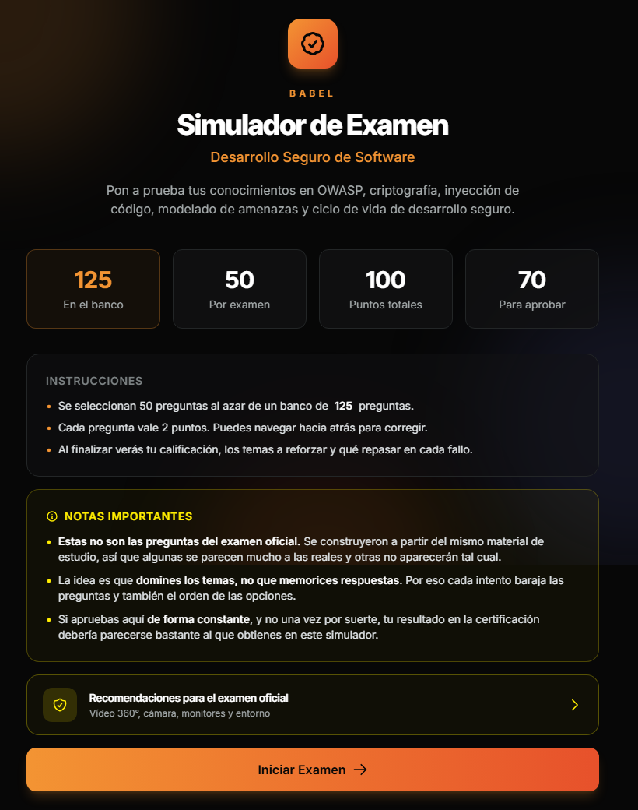
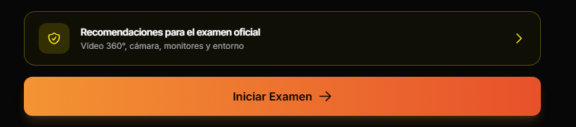
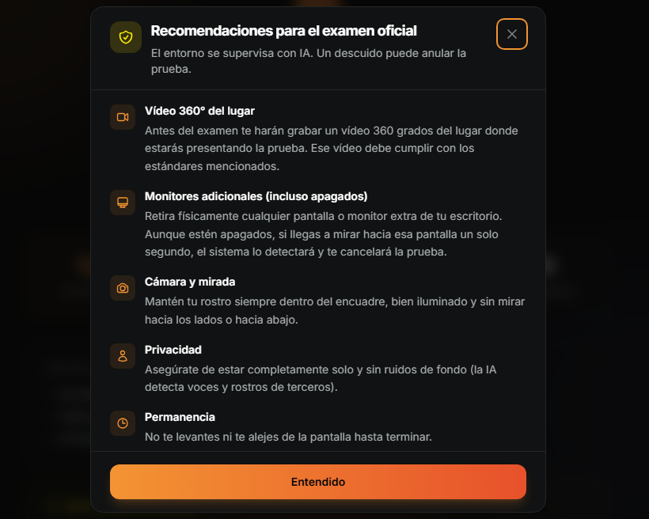
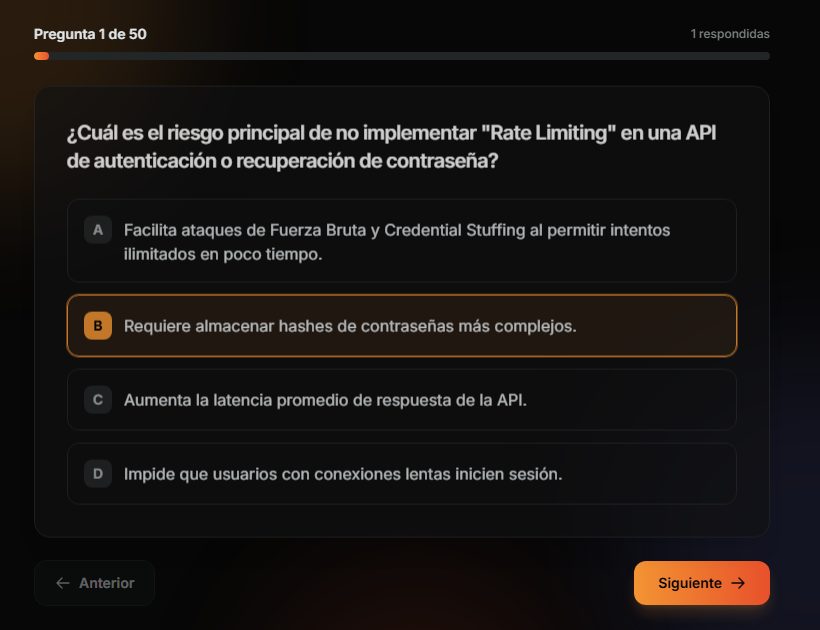
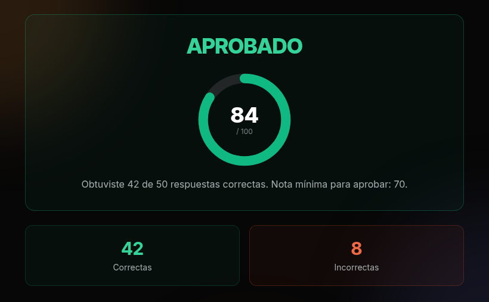
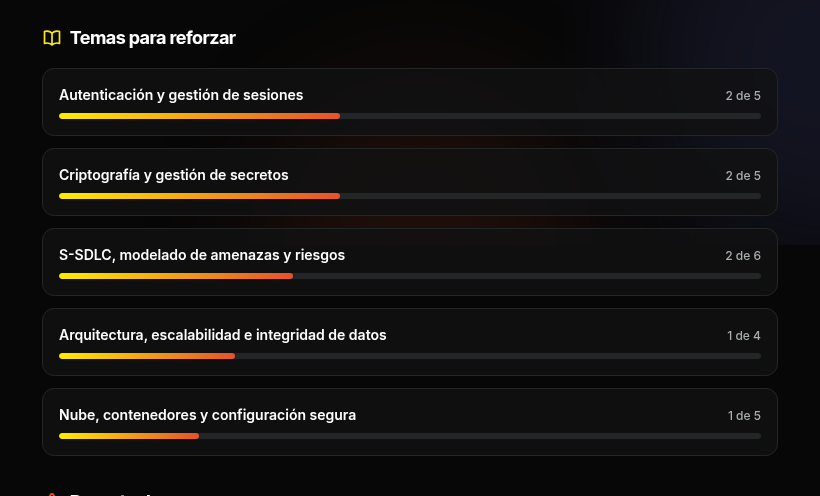
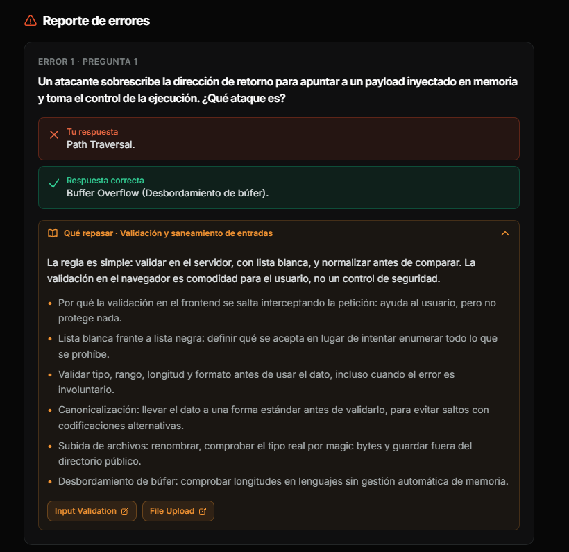
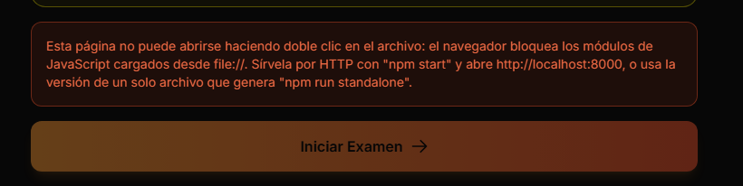

# Simulador de Examen · Desarrollo Seguro de Software

Aplicación web de práctica tipo test para preparar la certificación interna de **Desarrollo Seguro
de Software**. Genera exámenes aleatorios a partir de un banco de 125 preguntas, califica
automáticamente y, para cada fallo, explica qué conviene repasar y dónde estudiarlo.

Es un sitio estático **sin dependencias, sin backend y sin paso de compilación**: basta con
servirlo por HTTP. Toda la lógica son unos 700 renglones de JavaScript vanilla en módulos ES.

> **Repositorio privado.** El banco de preguntas procede de material de formación interno de la
> empresa. No debe publicarse en un repositorio público ni difundirse fuera de la organización.



## Inicio rápido

Para practicar, entra aquí: **<https://desarrollosegurotest.netlify.app/>**

Si quieres correrlo en local:

```bash
git clone <url-del-repositorio>
cd DesarrolloSeguroTest
npm start
```

Abre <http://localhost:8000>. No hace falta `npm install`: el proyecto no tiene dependencias.

> **Ojo:** abrir `index.html` con doble clic **no funciona**. El navegador bloquea los módulos ES
> servidos por `file://`. Si prefieres un archivo que sí se abra con doble clic, usa
> [`npm run standalone`](#opción-2--archivo-único-para-mostrar-o-compartir).

---

## Tabla de contenidos

- [Capturas](#capturas)
- [Características](#características)
- [Temario cubierto](#temario-cubierto)
- [Requisitos previos](#requisitos-previos)
- [Puesta en marcha](#puesta-en-marcha)
- [Scripts disponibles](#scripts-disponibles)
- [Estructura del proyecto](#estructura-del-proyecto)
- [Arquitectura](#arquitectura)
- [Cómo funciona](#cómo-funciona)
- [Recomendaciones de estudio](#recomendaciones-de-estudio)
- [Identidad visual](#identidad-visual)
- [Formato del banco de preguntas](#formato-del-banco-de-preguntas)
- [Cómo añadir o editar preguntas](#cómo-añadir-o-editar-preguntas)
- [Reglas de calificación](#reglas-de-calificación)
- [Pruebas](#pruebas)
- [Solución de problemas](#solución-de-problemas)
- [Despliegue en Netlify](#despliegue-en-netlify)
- [Tecnologías](#tecnologías)
- [Accesibilidad](#accesibilidad)
- [Limitaciones conocidas](#limitaciones-conocidas)
- [Roadmap](#roadmap)
- [Cómo contribuir](#cómo-contribuir)
- [Licencia y uso](#licencia-y-uso)

---

## Capturas

**Recomendaciones para el examen oficial.** En la bienvenida, un botón abre un modal con las
condiciones del entorno supervisado: vídeo 360° del lugar, cámara, monitores, dispositivos y
escritorio.





**Durante el examen.** Una pregunta a la vez, con barra de progreso, contador de respondidas y
navegación hacia atrás para corregir antes de finalizar.



**Resultado.** Nota sobre 100 con anillo animado, veredicto en verde o rojo y desglose de aciertos
y fallos.



**Temas para reforzar.** Las áreas con más fallos, ordenadas y con la proporción sobre las
preguntas de ese tema que salieron en el examen.



**Reporte de errores.** Cada fallo muestra la respuesta marcada frente a la correcta y un bloque
plegable con la guía de repaso del tema y enlaces a las OWASP Cheat Sheets.



Las capturas se regeneran con `npm run capturas`, que recorre la aplicación en un navegador
headless y recorta cada zona. No están hechas a mano, así que no se quedan desactualizadas.

## Características

- **Banco de 125 preguntas** de opción múltiple con cuatro alternativas cada una.
- **Examen aleatorio de 50 preguntas** por intento: nunca sale el mismo examen dos veces.
- **Opciones barajadas** en cada pregunta, de modo que no es posible memorizar la posición de la
  respuesta correcta.
- **Navegación bidireccional**: se puede volver atrás a corregir antes de finalizar.
- **Calificación instantánea** sobre 100 puntos con indicador circular animado.
- **Reporte de errores** que muestra, para cada fallo, la respuesta marcada frente a la correcta.
- **Recomendaciones de estudio** bajo cada pregunta fallada, con los puntos concretos a repasar y
  enlaces a las OWASP Cheat Sheets del tema.
- **Resumen de temas flojos** que ordena las áreas con más fallos para orientar el repaso.
- **Recomendaciones para el examen oficial** en un modal accesible desde la bienvenida, con las
  condiciones del entorno supervisado (vídeo 360° del lugar, monitores, cámara, dispositivos y escritorio).
- **Interfaz responsive** en modo oscuro con la identidad visual de Babel.
- **Versión de archivo único** que se abre con doble clic y se puede compartir por correo.
- **Suite de pruebas** sobre la lógica del examen y la integridad de los datos.

### Alcance del simulador

La pantalla de bienvenida muestra el tamaño total del banco y un bloque de **notas importantes**
con la advertencia de que estas no son las preguntas del examen oficial: se construyeron a partir
del mismo material de estudio, así que algunas se parecen mucho a las reales y otras no aparecerán
tal cual. El propósito es dominar los temas, no memorizar respuestas, y por eso cada intento baraja
tanto las preguntas como el orden de las opciones. Aprobar aquí de forma constante, y no una vez
por suerte, es la mejor señal de que el resultado en la certificación se va a parecer al que se
obtiene en el simulador. La pantalla de resultados repite ese recordatorio en corto, junto al botón
de reinicio.

Justo encima de *Iniciar Examen* hay un botón que abre un modal con las **recomendaciones para el
examen oficial**: qué exige el entorno supervisado por IA (vídeo 360° del lugar, monitores
adicionales retirados, rostro en el encuadre, sin terceros, una sola pestaña, sin atajos de copiado
ni capturas, notificaciones apagadas, dispositivos guardados y escritorio despejado). Es contenido
estático dentro de
`index.html`; el modal usa el elemento `<dialog>` nativo, así que se cierra con <kbd>Esc</kbd>, con
un clic fuera o con el botón *Entendido*, y el foco vuelve al botón que lo abrió.

## Temario cubierto

| Bloque | Contenidos |
| --- | --- |
| Ingeniería social | Phishing, whaling, vishing, smishing, dumpster diving |
| OWASP | OWASP Top 10, OWASP ZAP, controles recomendados |
| Inyección | SQL Injection, prepared statements, consultas parametrizadas |
| Cliente y navegador | XSS, cabeceras HTTP de seguridad, cookies `HttpOnly` frente a `localStorage` |
| Criptografía | Hashing, cifrado, claves hardcodeadas, gestión de secretos |
| Validación y errores | Validación cliente frente a servidor, manejo seguro de excepciones y logging |
| S-SDLC | Ciclo de vida de desarrollo seguro, modelado de amenazas, trazabilidad de requisitos |
| Pruebas de seguridad | SAST, DAST, SCA, fuzzing, pruebas de autorización |
| Bases de datos | Integridad transaccional, `SAVEPOINT` y `ROLLBACK` |
| Malware y ataques | Troyanos, DoS y DDoS, credential stuffing, threat hunting |

## Requisitos previos

Para **usar** el simulador solo hace falta un navegador moderno y una forma de servir la carpeta
por HTTP. Lo demás es opcional y solo interviene en tareas de mantenimiento.

| Herramienta | Versión | Necesaria para |
| --- | --- | --- |
| Navegador con soporte de módulos ES | Chrome, Firefox, Edge o Safari recientes | Ejecutar la aplicación |
| Python 3 | 3.x | `npm start` |
| Node.js | 18 o superior (probado en 24) | `npm test`, `npm run standalone` |
| Google Chrome o Chromium | cualquiera reciente | `npm run capturas` |

Sin Python puedes usar `npm run start:npx`, que levanta el mismo servidor con `npx serve`. En
Windows, `py -3 -m http.server 8000` también sirve.

Se necesita conexión a internet la primera vez que se carga la página, porque Tailwind CSS y las
tipografías Inter vienen de CDN. Sin conexión la aplicación funciona igual, pero se ve sin estilos.

## Puesta en marcha

> **Abrir `index.html` con doble clic no funciona.** El navegador bloquea por CORS tanto los
> módulos ES como el `fetch` de los datos cuando la página se sirve por `file://`. Si lo intentas,
> la pantalla de inicio muestra un aviso explicándolo y el botón queda deshabilitado.

Hay dos formas de usarlo.

### Opción 1 — Servidor local (desarrollo)

```bash
npm start                    # equivale a: python3 -m http.server 8000
```

Luego abre <http://localhost:8000>. Cualquier otro servidor estático sirve igual:

```bash
npm run start:npx            # npx serve, si no tienes Python
php -S localhost:8000
```

### Opción 2 — Archivo único (para mostrar o compartir)

```bash
npm run standalone
```

Genera `dist/simulador-standalone.html`, un archivo de unos 108 KB con el marcado, los estilos, la
lógica y las 125 preguntas incrustados. **Ese sí se abre con doble clic**, y se puede enviar por
correo o copiar en un USB sin necesitar el resto del proyecto.

El script está en `tools/construir-standalone.mjs`: aplana los módulos ES a un único script en
línea, incrusta los dos JSON de datos y sustituye la descarga por los datos ya embebidos. La
carpeta `dist/` está en el `.gitignore`, así que el archivo no se versiona; se regenera cuando haga
falta.

## Scripts disponibles

| Comando | Qué hace |
| --- | --- |
| `npm start` | Sirve la carpeta en <http://localhost:8000> con Python. |
| `npm run start:npx` | Lo mismo con `npx serve`, para máquinas sin Python. |
| `npm test` | Ejecuta las 20 pruebas con el runner integrado de Node. |
| `npm run standalone` | Genera `dist/simulador-standalone.html`. |
| `npm run capturas` | Regenera las imágenes de `docs/capturas/` con Chrome headless. |

## Estructura del proyecto

```
DesarrolloSeguroTest/
├── index.html                   # Marcado de las tres pantallas
├── package.json                 # Scripts de arranque y pruebas (sin dependencias)
├── netlify.toml                 # Configuración de despliegue
├── .gitignore
├── README.md
├── data/
│   ├── preguntas.json           # Banco de 125 preguntas, cada una etiquetada por tema
│   └── temas.json               # Guías de repaso y recursos de los 19 temas
├── src/
│   ├── css/
│   │   └── styles.css           # Scrollbar, animación de entrada, reduced-motion
│   └── js/
│       ├── main.js              # Punto de entrada: carga los datos y conecta los eventos
│       ├── config.js            # Parámetros del examen
│       ├── banco.js             # Descarga y validación de los JSON de datos
│       ├── quiz.js              # Estado del examen y calificación (sin DOM)
│       ├── ui.js                # Renderizado y manipulación del DOM
│       ├── utils.js             # Barajado, animación numérica, iconos SVG
│       └── tailwind.config.js   # Paleta de marca y tipografías
├── tools/
│   ├── construir-standalone.mjs # Genera la versión de un solo archivo
│   └── capturar-pantallas.mjs   # Regenera las capturas del README
├── tests/
│   ├── quiz.test.mjs            # Pruebas de la lógica y de los datos
│   └── standalone.test.mjs      # Pruebas del generador de archivo único
└── docs/
    ├── capturas/                # Imágenes usadas en este README
    └── fuentes/                 # PDFs originales del curso (no se publican)
```

Los PDFs de `docs/fuentes/` son el material del que se extrajo el banco. La aplicación no los usa
en tiempo de ejecución y quedan **excluidos del despliegue** (ver [Despliegue](#despliegue-en-netlify));
se conservan en el repositorio como trazabilidad de las respuestas.

## Arquitectura

El código está separado por responsabilidades, con una regla principal: **`quiz.js` no toca el
DOM y `ui.js` no calcula nada**. Eso permite probar toda la lógica del examen en Node sin
navegador ni librerías de testing.

```
        ┌───────────┐
        │  main.js  │  orquesta: carga datos, conecta eventos, decide transiciones
        └─────┬─────┘
      ┌───────┼────────┬──────────────┐
      ▼       ▼        ▼              ▼
 ┌────────┐ ┌──────┐ ┌────────┐  ┌──────────┐
 │banco.js│ │quiz.js│ │ ui.js  │  │config.js │
 │ fetch  │ │estado │ │  DOM   │  │constantes│
 │validar │ │y nota │ │        │  │          │
 └────────┘ └───┬───┘ └───┬────┘  └──────────┘
                └────┬────┘
                     ▼
                 ┌────────┐
                 │utils.js│  barajar, animarNumero, crearIcono
                 └────────┘
```

Todo el texto dinámico se inserta con `textContent` y los elementos se crean con
`createElement`, nunca con `innerHTML`. En una aplicación sobre desarrollo seguro parecía lo
mínimo exigible.

## Cómo funciona

La aplicación es una SPA de tres pantallas que coexisten en el DOM; solo una está visible a la
vez mediante la clase `hidden`.

```
┌──────────────────┐   Iniciar Examen   ┌──────────────────┐   Finalizar   ┌───────────────────┐
│  welcome-screen  │ ─────────────────▶ │   quiz-screen    │ ────────────▶ │  results-screen   │
│  Bienvenida      │                    │  Pregunta N/50   │               │  Nota y reporte   │
└──────────────────┘                    └──────────────────┘               └───────────────────┘
         ▲                                                                           │
         └───────────────────────── Reiniciar Examen ────────────────────────────────┘
```

### Flujo detallado

1. **Arranque** (`main.js`). El botón de inicio nace deshabilitado. Se descarga
   `data/preguntas.json`, se descartan las entradas malformadas, se escribe el total en todos los
   elementos marcados con `data-bank-count` de la pantalla de bienvenida y solo entonces se
   habilita el botón. Si la descarga falla, se muestra un aviso en pantalla en lugar de dejar la
   interfaz muerta.

2. **Generación del examen** (`quiz.generarExamen`). Se baraja el banco completo con Fisher-Yates
   y se toman las primeras 50 preguntas. De cada una se guarda el texto de la respuesta correcta,
   se barajan las opciones y se recalcula el índice correcto con `indexOf` sobre el array ya
   barajado.

3. **Renderizado** (`ui.renderPregunta`). Construye los botones de opción con las etiquetas A–D
   generadas al vuelo, actualiza la barra de progreso y el contador de respondidas, y marca la
   opción ya elegida si el usuario vuelve atrás. El botón *Siguiente* está deshabilitado hasta que
   haya una opción marcada y pasa a llamarse *Finalizar* en la última pregunta.

4. **Registro de respuestas.** Las selecciones se guardan en el array `respuestas` del estado, en
   la misma posición que su pregunta. Las no contestadas quedan como `null`.

5. **Calificación** (`quiz.calcularResultado`). Compara cada respuesta con su `indiceCorrecto` y
   devuelve un objeto con aciertos, fallos, nota, si está aprobado y la lista de errores. Es una
   función pura sobre el estado: no toca la interfaz.

6. **Resultados** (`ui.renderResultados`). Pinta el banner en verde o rojo, anima el anillo SVG
   mediante `stroke-dashoffset` y el número con `requestAnimationFrame`, muestra el resumen de
   temas flojos y genera una tarjeta por cada fallo con la respuesta marcada, la correcta y la
   guía de repaso del tema. Sin errores, muestra un mensaje de examen perfecto.

7. **Reinicio.** *Reiniciar Examen* vuelve a `iniciarExamen` y genera un examen nuevo desde cero.

### Estado en memoria

| Campo | Descripción |
| --- | --- |
| `preguntas` | Las 50 preguntas del intento, con opciones ya barajadas. |
| `respuestas` | Índice elegido en cada pregunta, o `null` si no se ha respondido. |
| `indice` | Posición de la pregunta que se está mostrando. |

No se usa `localStorage` ni hay backend: al recargar la página se pierde el progreso.

## Recomendaciones de estudio

Cada pregunta está etiquetada con uno de **19 temas**, y `data/temas.json` guarda para cada tema
una guía de repaso. Con eso, el reporte final añade dos cosas.

Bajo cada pregunta fallada aparece un bloque plegable **"Qué repasar"** con el nombre del tema, un
resumen de por qué se suele fallar ahí, entre tres y siete puntos concretos que conviene revisar,
y enlaces a las OWASP Cheat Sheets correspondientes.

Encima del reporte se muestra **"Temas para reforzar"**: los temas ordenados por número de fallos,
con la proporción sobre las preguntas de ese tema que salieron en el examen y una barra de
progreso. Es el atajo para saber por dónde empezar a estudiar.

Todo el contenido es estático y está en el repositorio. **No se llama a ninguna API ni a ningún
modelo de IA en tiempo de ejecución**, lo que evita claves expuestas en el frontend, costos por
uso, latencia y el riesgo de que una explicación inventada te enseñe algo incorrecto.

Los temas y su reparto en el banco:

| Tema | Preguntas | Tema | Preguntas |
| --- | ---: | --- | ---: |
| S-SDLC, modelado de amenazas y riesgos | 13 | Malware y seguridad de red | 6 |
| Criptografía y gestión de secretos | 12 | Arquitectura, escalabilidad e integridad de datos | 6 |
| Autenticación y gestión de sesiones | 10 | Principios de diseño seguro | 6 |
| Seguridad web y del navegador | 10 | Seguridad en aplicaciones móviles | 5 |
| Nube, contenedores y configuración segura | 8 | Seguridad de APIs | 4 |
| Validación y saneamiento de entradas | 7 | Seguridad en inteligencia artificial | 4 |
| Ingeniería social y agentes de amenaza | 6 | Protección del software y aislamiento | 4 |
| Inyección de código y consultas seguras | 6 | Registro, monitorización y manejo de errores | 3 |
| Control de acceso y autorización | 6 | Dependencias y cadena de suministro | 3 |
| Pruebas de seguridad y análisis de código | 6 | | |

### Formato de `temas.json`

```json
{
  "criptografia": {
    "nombre": "Criptografía y gestión de secretos",
    "resumen": "Aquí se falla por dos motivos: elegir el algoritmo equivocado...",
    "repasar": [
      "Hash frente a cifrado: el hash va en un solo sentido y produce longitud fija...",
      "Contraseñas: bcrypt, scrypt o Argon2 con salt único..."
    ],
    "recursos": [
      {
        "titulo": "Password Storage",
        "url": "https://cheatsheetseries.owasp.org/cheatsheets/Password_Storage_Cheat_Sheet.html"
      }
    ]
  }
}
```

Si un tema no tiene guía, la aplicación lo avisa por consola y simplemente omite el bloque de
recomendación en esa tarjeta, sin romper nada.

## Identidad visual

La interfaz sigue la paleta corporativa de [Babel](https://babelgroup.com/), extraída del tema de
su sitio web. El naranja es el color principal, sobre fondo negro y con la escala de grises de la
marca.

| Token Tailwind | Hex | Uso |
| --- | --- | --- |
| `babel-orange` | `#F39433` | Color principal: botones, acentos, opción seleccionada |
| `babel-orange-soft` | `#F6AF67` | Estado hover del naranja principal |
| `babel-ember` | `#E7512B` | Naranja intenso: degradados y estados de error |
| `babel-sun` | `#FFED00` | Amarillo de acento en las notas y las barras de temas flojos |
| `babel-navy` | `#383A6F` | Azul noche del fondo decorativo |
| `babel-ink` | `#070707` | Fondo de la página |
| `babel-carbon` | `#111213` | Superficie de tarjetas |
| `babel-line` | `#232627` | Bordes y separadores |
| `babel-steel` | `#5F6567` | Gris corporativo para bordes activos |
| `babel-muted` | `#7C8283` | Texto terciario y etiquetas |
| `babel-ash` | `#A8AEAF` | Texto secundario |
| `babel-mist` | `#E2E6E8` | Texto principal |

Los tokens se declaran en `src/js/tailwind.config.js` y se usan siempre como clases completas
(`bg-babel-orange`, `border-babel-line`), nunca construidas por interpolación, para que sigan
funcionando si algún día se compila Tailwind en lugar de cargarlo por CDN.

**Tipografía:** Inter para el texto e Inter Tight para los titulares (clase `font-display`), las
dos que usa Babel en su web y ambas disponibles en Google Fonts.

**Excepción semántica:** el verde esmeralda de "Correctas" y "Aprobado" no pertenece a la paleta
de marca, pero se mantiene porque el par verde/naranja comunica acierto y error de forma
inmediata. Los estados de error sí usan `babel-ember`.

## Formato del banco de preguntas

`data/preguntas.json` es un array de objetos con esta forma:

```json
{
  "id": 1,
  "tema": "ingenieria-social",
  "pregunta": "¿Qué busca un ataque de \"Whaling\"?",
  "opciones": [
    "Comprometer a objetivos de alto perfil o ejecutivos (C-Level) mediante ingeniería social muy sofisticada.",
    "Atacar servidores con grandes bases de datos.",
    "Enviar spam masivo a listas de correo muy grandes.",
    "Saturar un servicio con tráfico distribuido (DDoS)."
  ],
  "respuestaCorrecta": 0
}
```

| Campo | Tipo | Descripción |
| --- | --- | --- |
| `id` | `number` | Identificador único dentro del banco. |
| `tema` | `string` | Clave del tema en `temas.json`, usada para la guía de repaso. |
| `pregunta` | `string` | Enunciado que se muestra al usuario. |
| `opciones` | `string[]` | Alternativas **sin** la letra A/B/C/D; las etiquetas se generan al renderizar. |
| `respuestaCorrecta` | `number` | Índice de la opción correcta dentro de `opciones`. |

Por convención, la opción correcta se escribe siempre en la posición `0`. Esto no filtra nada al
usuario, porque las opciones se barajan en tiempo de ejecución y el índice correcto se recalcula
en `generarExamen()`.

Las entradas que no cumplan el formato se descartan al cargar y se avisa por consola, de modo que
un error de edición en una pregunta no impide usar el resto del banco.

## Cómo añadir o editar preguntas

1. Editar `data/preguntas.json` y añadir un objeto con un `id` que no esté en uso.
2. Asignarle un `tema` que exista en `data/temas.json`, o crear el tema nuevo allí con su guía.
3. Escribir la respuesta correcta en la primera posición de `opciones` y dejar
   `"respuestaCorrecta": 0`.
4. Ejecutar `npm test` para validar el formato y que el tema tenga guía.
5. Recargar el navegador. El contador de preguntas se actualiza solo.

Recomendaciones al redactar:

- Mantener las cuatro opciones con longitud y nivel de detalle similares, para que la correcta no
  se deduzca por ser la más extensa.
- Evitar distractores absurdos: deben ser plausibles para que el test tenga valor formativo.
- No repetir literalmente el mismo texto en dos opciones de la misma pregunta; las pruebas lo
  detectan y fallan.

## Reglas de calificación

| Parámetro | Constante en `src/js/config.js` | Valor |
| --- | --- | --- |
| Preguntas por examen | `TOTAL_PREGUNTAS_EXAMEN` | 50 |
| Puntos por acierto | `PUNTOS_POR_PREGUNTA` | 2 |
| Puntuación máxima | — | 100 |
| Nota mínima para aprobar | `NOTA_APROBACION` | 70 |

No hay penalización por fallo y no se puede avanzar dejando una pregunta en blanco, así que todo
examen finalizado tiene las 50 respuestas contestadas.

## Pruebas

```bash
npm test
```

Usa el runner integrado de Node (`node --test`), sin dependencias externas. Cubre el barajado sin
mutación, el tamaño y unicidad del examen generado, que el índice correcto siga a su texto tras
barajar las opciones, el cálculo de la nota en los extremos y en el límite exacto de aprobación,
las preguntas sin responder, los topes de navegación y la integridad del banco (IDs únicos,
opciones no repetidas, índices dentro de rango).

También valida los datos de estudio: que toda pregunta tenga un tema con guía, que no queden
temas huérfanos sin preguntas, que cada guía traiga nombre, resumen, al menos tres puntos de
repaso y recursos con URL `https`, y que el resumen de temas flojos cuadre con los errores
cometidos y venga ordenado de más a menos fallos.

`standalone.test.mjs` ejecuta el generador de archivo único y comprueba que el resultado no deje
referencias externas, que no queden sentencias `import` ni `export` capaces de romper el script en
línea, que los datos y todos los temas queden incrustados y que se generen los espacios de nombres
que el código usa por prefijo.

## Solución de problemas

**El botón "Iniciar Examen" está apagado y no responde.** Es el caso más común: la página se abrió
con doble clic, es decir por `file://`, y el navegador bloquea los módulos ES por CORS. La propia
aplicación lo detecta y lo avisa en pantalla.



La solución es levantar el servidor con `npm start` y entrar por <http://localhost:8000>, o generar
el archivo único con `npm run standalone`.

**La página se ve como texto plano, sin colores ni maquetación.** Tailwind y las tipografías se
cargan desde CDN. Sin internet, o con un proxy corporativo que bloquee `cdn.tailwindcss.com` y
`fonts.googleapis.com`, la aplicación sigue siendo funcional pero pierde todo el estilo.

El resto de tropiezos habituales:

| Síntoma | Causa | Solución |
| --- | --- | --- |
| `python3: command not found` | Python no instalado o no en el `PATH` | `npm run start:npx`, o `py -3 -m http.server 8000` en Windows |
| `Address already in use` | El puerto 8000 está ocupado | `python3 -m http.server 8001` y entrar por ese puerto |
| 404 en `data/preguntas.json` | El servidor se lanzó desde otra carpeta | Arrancarlo desde la raíz del proyecto |
| Los cambios no se reflejan | Caché del navegador | Recarga forzada con <kbd>Ctrl</kbd>+<kbd>Shift</kbd>+<kbd>R</kbd> |
| `bad option: --test` al probar | Node.js anterior a la 18 | Actualizar Node.js |
| `No se encontró Chrome` en `npm run capturas` | Chrome no instalado o con otro nombre | Instalarlo o definir `CHROME_BIN` |
| Consola: `Se descartaron N preguntas...` | Alguna entrada del JSON no cumple el formato | Revisar esas preguntas y ejecutar `npm test` |
| Consola: `Temas sin guía de repaso: ...` | Una pregunta usa un tema que no está en `temas.json` | Crear la guía del tema o corregir la etiqueta |

Si algo sigue sin funcionar, abre las herramientas de desarrollo del navegador
(<kbd>F12</kbd>) y mira la pestaña *Console*: los fallos de carga se registran ahí con el motivo
exacto.


## Tecnologías

| Tecnología | Uso | Origen |
| --- | --- | --- |
| HTML5 | Estructura de las tres pantallas | — |
| JavaScript (módulos ES) | Lógica del simulador | Vanilla, sin framework |
| Tailwind CSS | Estilos y diseño responsive | CDN |
| Inter e Inter Tight | Tipografía de texto y titulares | Google Fonts |
| SVG | Iconografía y anillo de puntuación | Inline |
| `node:test` | Pruebas | Node.js |
| Chrome DevTools Protocol | Generación de las capturas | Chrome headless |

## Accesibilidad

Lo que hay resuelto hoy: las opciones son `<button>` nativos, así que se recorren con
<kbd>Tab</kbd> y se activan con <kbd>Enter</kbd> o <kbd>Espacio</kbd>; la opción marcada expone
`aria-pressed`; el aviso de error de carga lleva `role="alert"` para que los lectores de pantalla
lo anuncien; y las animaciones se desactivan con `prefers-reduced-motion`.

Lo que falta: atajos de teclado para responder con las teclas 1–4 y anillo de foco visible en los
botones de opción, no solo en el de inicio. Ambos están en el [roadmap](#roadmap).

## Limitaciones conocidas

- **Requiere servidor HTTP.** Con `file://` el navegador bloquea los módulos ES y el `fetch` de los
  datos. Para abrirlo sin servidor está la [versión de archivo único](#opción-2--archivo-único-para-mostrar-o-compartir).
- **Dependencia de CDN.** Sin internet la página funciona, pero se ve sin estilos.
- **Tailwind vía CDN.** Pensado para prototipado; en producción conviene compilar los estilos.
- **Sin persistencia.** Al recargar se pierde el examen en curso y el historial de intentos.
- **Sin temporizador.** No se limita el tiempo de resolución.
- **Recomendaciones por tema, no por pregunta.** La guía explica el área, pero no justifica el
  matiz concreto de cada enunciado.


---

Desarrollado por Juan Turriago.
